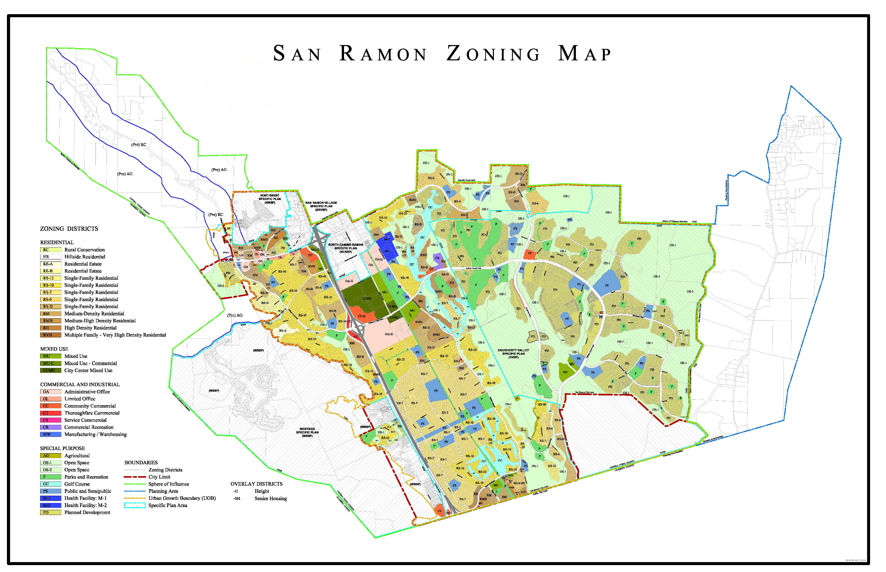

#  **Urban Green Infrastructure Planning US City San Ramon** 
## **About Web Map:**

The Web map was created for urban planning and visualization of the zoning of Areas like Green Space, open space agricultural land, etc. This Web Map Demonstration Also helps understand the sunrise and population of U.S. cities. 

This Web Map Design for Urban Green Infrastructure Planning US City San Ramon. This web map can help the stakeholder and user visualize the parcel on a basic zoning District area. This web Map uses Three Types of Data Dataset 
--- ---
## **About Data & Source**
- **U.S City Population Data**  [Data Link](https://github.com/umass-gis/workshops/blob/main/content/web-map/data/sunlight_datapack.zip)
- **U.S City Sunset Data**      [Data Link](https://github.com/umass-gis/workshops/blob/main/content/web-map/data/sunlight_datapack.zip)
- **U.S San Ramon Zoning Parcel** [Data Link](https://cdnsm5-hosted.civiclive.com/UserFiles/Servers/Server_10826046/File/Our%20City/Departments/Community%20Development/Planning/Zoning%20Ordinance/ZONING%20MAP%20201225.pdf)
--- ---   
The Zoning Distracts Futhr Classifcation like
- **Residential Area:**  (Rural Conservation, Hillside Residential, Residential Estate, Single-Family Residential, Medium-Density Residential ..etc)
- **Mixed Use:** (Mixed used, Maxed commercial used ..etc)
- **Commercial and Industrial:** (Administrative Office, Limited Office, Manufacturing/Warehousing ...etc)
- **Special Purpose:** (Urban Growth Boundary, Planned Development, Parks and Recreation, Open Space Agricultural ..etc)
--- ---
## **Zoning Map**

